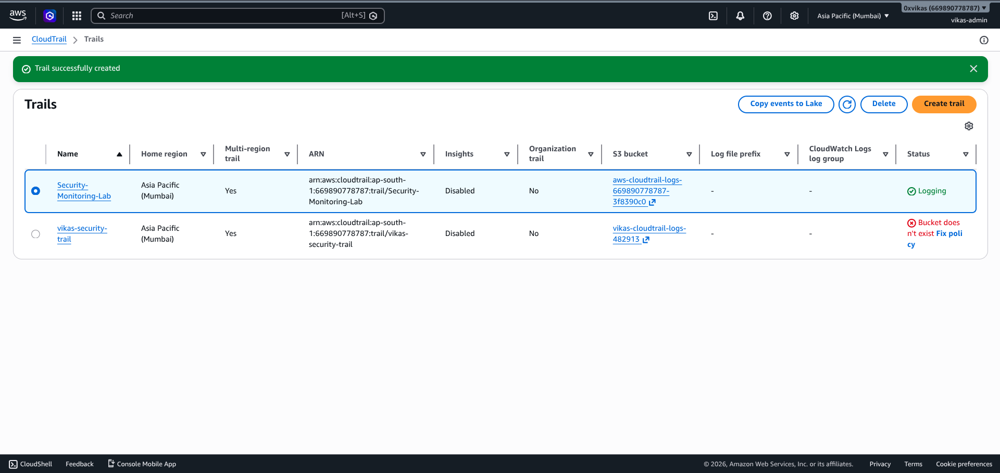
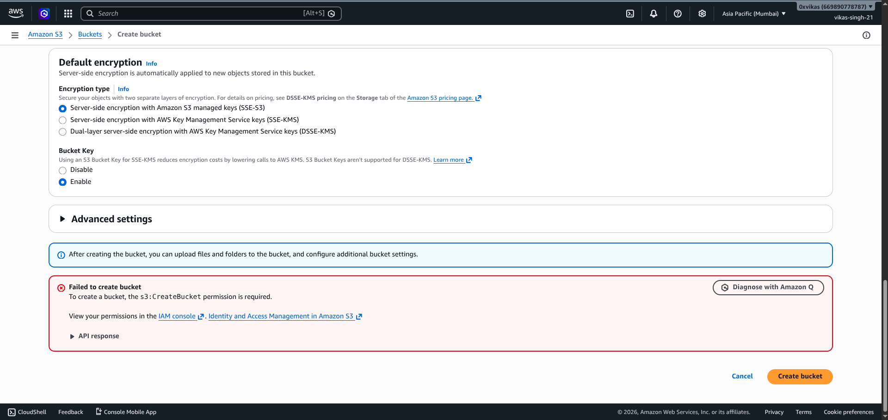
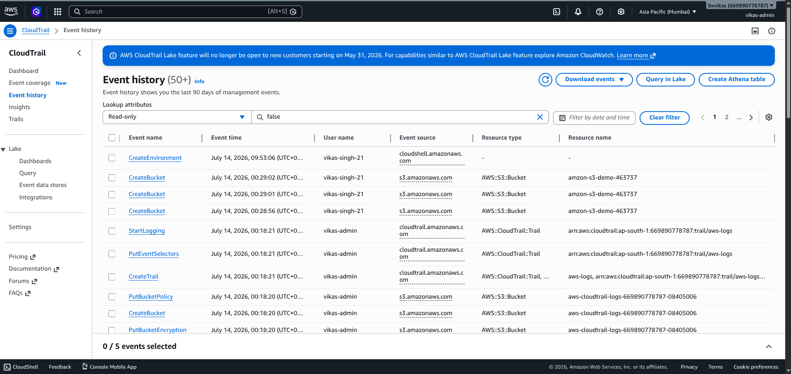
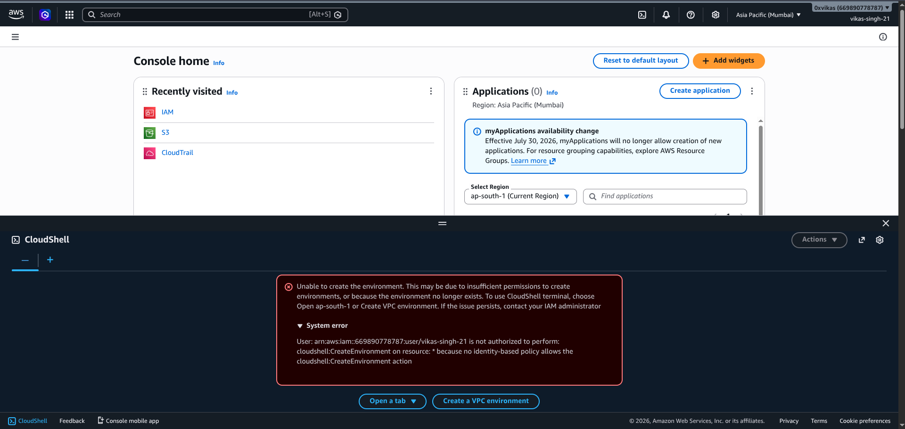
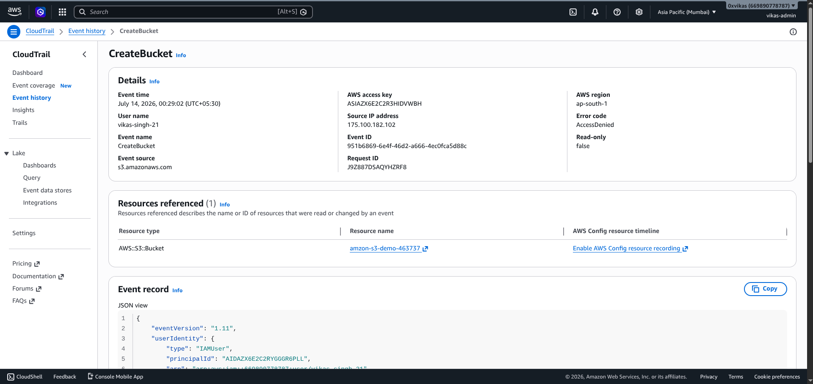
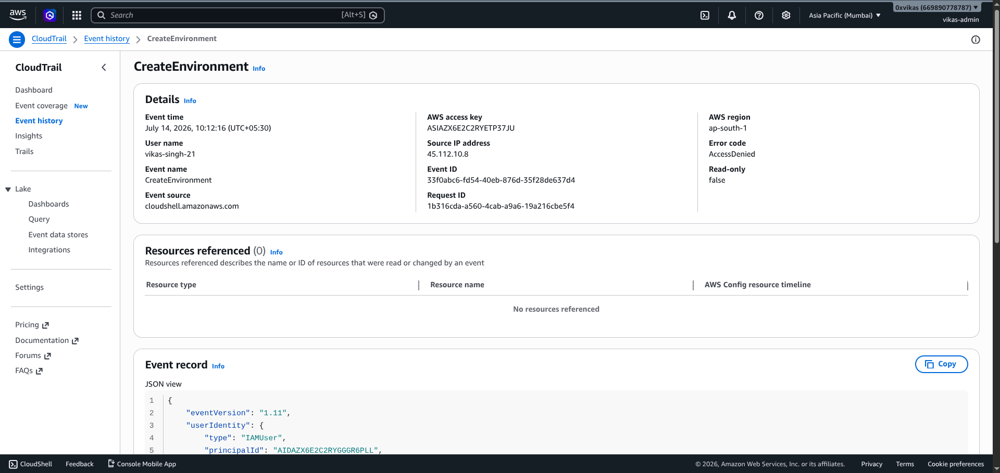

# 🛡️ AWS CloudTrail Security Monitoring Lab

## 📖 Overview

This project demonstrates how AWS CloudTrail can be used to monitor, detect, and investigate unauthorized IAM activities in an AWS environment.

A restricted IAM user was intentionally used to simulate unauthorized AWS actions, including Amazon S3 bucket creation and AWS CloudShell access. AWS CloudTrail successfully captured these events, allowing investigation through Event History and raw JSON logs.

The project follows a real-world cloud security monitoring workflow consisting of attack simulation, event detection, investigation, log analysis, and incident reporting.

---

# 🚀 Features

- Multi-Region AWS CloudTrail Configuration
- IAM Least Privilege Validation
- Unauthorized Amazon S3 Bucket Creation Detection
- Unauthorized AWS CloudShell Access Detection
- CloudTrail Event Investigation
- Raw JSON Log Analysis
- Incident Reporting
- Security Recommendations

---

# 🧪 Lab Environment

| Component | Details |
|-----------|---------|
| Cloud Provider | AWS |
| Region | ap-south-1 (Mumbai) |
| Monitoring Service | AWS CloudTrail |
| IAM User | Restricted IAM User (`vikas-singh-21`) |
| Log Storage | Amazon S3 |

---

# 🏗️ Architecture

> Architecture diagram will be added here.

```
Restricted IAM User
        │
        ▼
AWS API Requests
        │
        ▼
AWS CloudTrail
        │
        ▼
CloudTrail Event History
        │
        ▼
Event Investigation
        │
        ▼
Raw JSON Logs
        │
        ▼
Incident Report
```

---

# 🎯 Project Objectives

- Configure AWS CloudTrail for management event monitoring.
- Validate IAM least privilege controls.
- Simulate unauthorized cloud activities.
- Detect unauthorized API calls.
- Investigate CloudTrail events.
- Analyze raw JSON logs.
- Prepare an incident report.

---

# ⚔️ Attack Simulation

A restricted IAM user (`vikas-singh-21`) was created with limited permissions.

The following unauthorized activities were simulated:

- Attempted Amazon S3 Bucket Creation
- Attempted AWS CloudShell Access

Both actions intentionally generated **AccessDenied** events for security monitoring.

---

# 🔍 Detection Workflow

1. Configure AWS CloudTrail
2. Enable Management Event Logging
3. Perform Unauthorized AWS Actions
4. Capture CloudTrail Events
5. Investigate Event Details
6. Analyze JSON Logs
7. Document Findings
8. Prepare Incident Report

---

# 📸 Screenshots

## 1. CloudTrail Configuration

CloudTrail configured as a Multi-Region Trail with management event logging enabled.



---

## 2. Unauthorized Amazon S3 Bucket Creation Attempt

A restricted IAM user attempted to create an Amazon S3 bucket without the required IAM permissions.



---

## 3. CloudTrail Event History

CloudTrail successfully detected and recorded the unauthorized API calls generated during the attack simulation.



---

## 4. AWS CloudShell Access Denied

The restricted IAM user attempted to launch AWS CloudShell but was denied due to insufficient IAM permissions.



---

## 5. CreateBucket Event Investigation

Detailed CloudTrail investigation showing the CreateBucket event with **AccessDenied** and associated metadata.



---

## 6. CreateEnvironment Event Investigation

Detailed CloudTrail investigation showing the CreateEnvironment event with **AccessDenied** and complete event information.



---

# 📄 Event Log Analysis

## Event 1 — CreateBucket (Access Denied)

```json
{
  "eventName": "CreateBucket",
  "eventSource": "s3.amazonaws.com",
  "userName": "vikas-singh-21",
  "awsRegion": "ap-south-1",
  "errorCode": "AccessDenied"
}
```

### Analysis

- Unauthorized attempt to create an Amazon S3 bucket.
- IAM Least Privilege policy successfully prevented resource creation.
- CloudTrail recorded the complete management event.

---

## Event 2 — CreateEnvironment (Access Denied)

```json
{
  "eventName": "CreateEnvironment",
  "eventSource": "cloudshell.amazonaws.com",
  "userName": "vikas-singh-21",
  "awsRegion": "ap-south-1",
  "errorCode": "AccessDenied"
}
```

### Analysis

- Unauthorized attempt to launch AWS CloudShell.
- IAM permissions prevented environment creation.
- CloudTrail successfully recorded the event.

---

# 📊 Incident Summary

| Event | Service | Severity | Result |
|--------|----------|----------|--------|
| CreateBucket | Amazon S3 | Medium | AccessDenied |
| CreateEnvironment | AWS CloudShell | Medium | AccessDenied |
| CreateTrail | AWS CloudTrail | Informational | Success |
| StartLogging | AWS CloudTrail | Informational | Success |

---

# 🛡️ Security Recommendations

- Apply the Principle of Least Privilege.
- Enable Multi-Factor Authentication (MFA).
- Continuously monitor CloudTrail logs.
- Alert on repeated AccessDenied events.
- Review IAM permissions regularly.
- Enable centralized logging and monitoring.

---

# 📁 Repository Structure

```
aws-cloudtrail-security-monitoring/

├── README.md
├── Screenshots/
├── Logs/
│   ├── createbucket.json
│   └── createenvironment.json
└── Incident-Reports/
```

---

# 📚 MITRE ATT&CK Mapping

| Event | Technique |
|--------|-----------|
| Unauthorized AWS Actions | T1078 – Valid Accounts |

---

# 🔮 Future Improvements

- CloudWatch Log Integration
- Amazon EventBridge Alerts
- AWS Security Hub Integration
- AWS GuardDuty Integration
- SIEM Integration (Splunk / Microsoft Sentinel / Elastic)

---

# ✅ Conclusion

This project demonstrates how AWS CloudTrail can be used to monitor, detect, and investigate unauthorized IAM activities in a cloud environment.

By simulating real-world unauthorized AWS actions using a restricted IAM user, CloudTrail successfully captured management events that were analyzed using Event History and raw JSON logs. The project highlights the importance of IAM least privilege, event monitoring, and incident investigation as part of a cloud security monitoring workflow.
